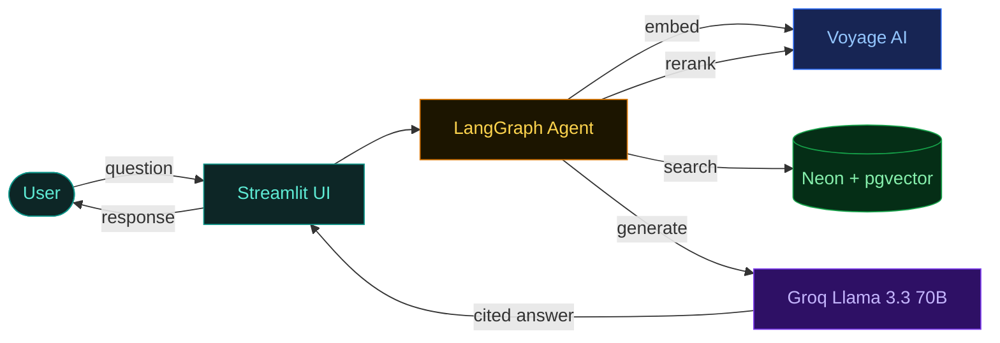

# FDA Drug Label Assistant

[](https://www.python.org/)
[](https://streamlit.io)
[](LICENSE)

A retrieval-augmented question-answering system over FDA-approved drug labels. Questions are answered only from cited source passages — the LLM has no freedom to hallucinate drug facts.

**Live demo:** https://fda-rag-gmlp6hufrw3trprm8h2srz.streamlit.app
**Docs:** [`docs/`](./docs/README.md)

---

## Example

> **Q:** What are the contraindications for warfarin?
>
> **A:** According to the Warfarin label, CONTRAINDICATIONS section, warfarin is contraindicated in patients with hemorrhagic tendencies, recent or contemplated surgery of the central nervous system or eye, and pregnancy (except in women with mechanical heart valves)…

Every claim is grounded in a specific drug label section returned by vector search.

---

## Architecture



The agent retrieves the 20 most similar passages with pgvector, reranks them down to 5 with a cross-encoder, and passes them to the LLM with strict citation instructions. Full breakdown in [`docs/02-query-flow.md`](./docs/02-query-flow.md).

---

## Tech stack

| Layer | Tool |
|---|---|
| Database | Neon (Postgres 16 + pgvector) |
| Embeddings | Voyage AI `voyage-3` (1024-dim) |
| Reranker | Voyage AI `rerank-2` |
| Agent | LangGraph |
| LLM | Groq `llama-3.3-70b-versatile` |
| UI | Streamlit |
| API | FastAPI (optional) |

---

## Setup

Requires accounts at [Neon](https://neon.tech), [Voyage AI](https://dash.voyageai.com), and [Groq](https://console.groq.com) — all have free tiers.

```bash
git clone https://github.com/mateoportillo1900/fda-rag.git
cd fda-rag
pip install -r requirements.txt
cp .env.example .env                 # add DATABASE_URL, VOYAGE_API_KEY, GROQ_API_KEY

python scripts/migrate.py            # create the drug_chunks table + HNSW index
python scripts/run_ingestion.py      # parse + embed 20 drug labels (~15 min)

streamlit run src/fda_rag/ui/app.py  # → http://localhost:8501
```

Ingestion takes about 15 minutes due to Voyage AI's free-tier rate limit (3 RPM / 10K TPM). Subsequent runs are skipped — chunks are only re-embedded when source XML changes.

---

## Data

20 FDA drug labels covering 8 therapeutic categories, sourced from [DailyMed](https://dailymed.nlm.nih.gov):

```
Metformin       Warfarin        Atorvastatin    Sertraline      Semaglutide
Adalimumab      Amoxicillin     Prednisone      Naloxone        Pembrolizumab
Lisinopril      Levothyroxine   Amlodipine      Omeprazole      Albuterol
Gabapentin      Escitalopram    Azithromycin    Apixaban        Metoprolol
```

After ingestion: 735 chunks indexed in Neon. To add more drugs, see [`docs/03-ingestion.md`](./docs/03-ingestion.md).

---

## Repository layout

```
src/fda_rag/
  ingestion/    parser.py · chunker.py · loader.py
  retrieval/    search.py · rerank.py
  agent/        state.py · nodes.py · graph.py
  api/          FastAPI HTTP wrapper
  ui/           Streamlit chat UI

scripts/        download_dailymed.py · migrate.py · run_ingestion.py
docs/           architecture, query flow, ingestion, database, code walkthrough
tests/          unit tests for each layer
data/sample/    committed FDA XML files (~5 MB)
```

File-by-file walkthrough: [`docs/05-code-walkthrough.md`](./docs/05-code-walkthrough.md).

---

## Documentation

| | |
|---|---|
| [Architecture](./docs/01-architecture.md) | System overview, RAG explained, offline/online split |
| [Query flow](./docs/02-query-flow.md) | Sequence diagram of a question end-to-end |
| [Ingestion](./docs/03-ingestion.md) | XML → chunks → vectors → DB |
| [Database](./docs/04-database.md) | Schema, HNSW index, pgvector search |
| [Code walkthrough](./docs/05-code-walkthrough.md) | File-by-file map, dependency graph |

---

## License

MIT. For educational use — not a substitute for professional medical advice.
