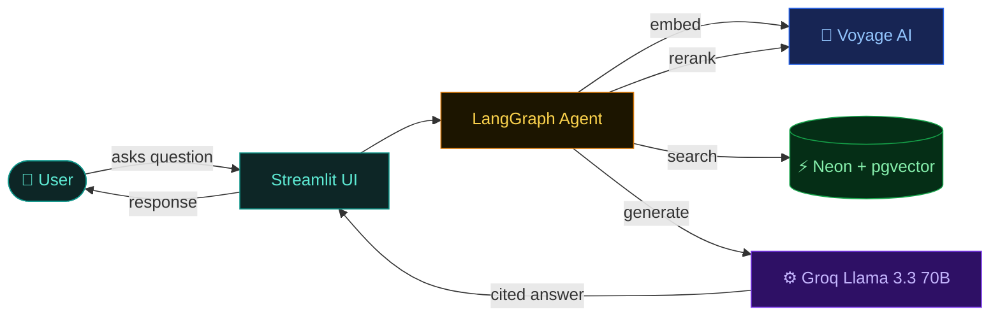
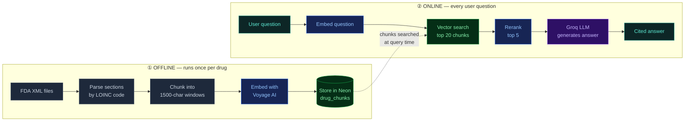

# 💊 FDA Drug Label Assistant


> Ask plain-English questions about FDA-approved drug labels and get cited, grounded answers — no hallucination.

**[🚀 Live Demo](https://fda-rag-gmlp6hufrw3trprm8h2srz.streamlit.app)** · **[📚 Documentation](./docs/README.md)** · **[💻 Source](https://github.com/mateoportillo1900/fda-rag)**

---

## At a glance



| | | | | |
|---|---|---|---|---|
| **20** drug labels | **735** indexed passages | **1024**-dim vectors | **70B** parameter LLM | **~2-3s** end-to-end |

---

## What it does

FDA drug labels contain the official, government-approved information about every prescription drug — what it treats, how to dose it, what it interacts with, what the warnings are. This data is public but buried in dense XML documents that are hard to search.

This app lets you ask questions like:

- *"What are the contraindications for warfarin?"*
- *"What drug interactions does atorvastatin have?"*
- *"How does apixaban work?"*
- *"Compare metformin and semaglutide interactions"*

…and get back a specific, cited answer drawn directly from the official FDA label text. Every claim links back to the source passage. The AI cannot make things up because it only ever sees the retrieved chunks.

---

## How it works

The project runs in **two phases**. The offline phase loads drug labels into a searchable vector database. The online phase serves user queries by retrieving the most relevant passages and feeding them to an LLM.



This pattern — **retrieve** relevant context, then **generate** an answer — is called **RAG (Retrieval-Augmented Generation)**. The LLM is constrained to only answer from what we hand it, so it cannot hallucinate drug facts.

→ Full breakdown in **[docs/02-query-flow.md](./docs/02-query-flow.md)** and **[docs/03-ingestion.md](./docs/03-ingestion.md)**.

---

## Tech stack

| Layer | Tool | Why this choice |
|---|---|---|
| 🟦 **Embeddings** | [Voyage AI](https://voyageai.com) `voyage-3` | Top of the MTEB retrieval leaderboard, generous free tier |
| 🟦 **Reranker** | Voyage AI `rerank-2` | Cross-encoder for true relevance — fixes vector-search false positives |
| 🟩 **Database** | [Neon](https://neon.tech) Postgres + pgvector | One DB for text + vectors. No second system to maintain |
| 🟨 **Agent** | [LangGraph](https://langchain-ai.github.io/langgraph/) | Typed state, explicit nodes, easy to debug and extend |
| 🟪 **LLM** | [Groq](https://groq.com) `llama-3.3-70b-versatile` | Sub-second latency (10× faster than OpenAI), truly free tier |
| 🟦 **API** | [FastAPI](https://fastapi.tiangolo.com) | Optional HTTP wrapper around the agent |
| 🟦 **UI** | [Streamlit](https://streamlit.io) | Full chat interface in ~350 lines of Python |

---

## Documentation

| Page | What it covers |
|---|---|
| **[📋 Architecture overview](./docs/01-architecture.md)** | What RAG is, all 5 services, offline vs. online split |
| **[🔄 Query flow](./docs/02-query-flow.md)** | Sequence diagram of every user question, LangGraph state graph |
| **[📥 Ingestion pipeline](./docs/03-ingestion.md)** | XML → chunks → vectors → DB, LOINC codes, rate-limit handling |
| **[🗄️ Database & pgvector](./docs/04-database.md)** | Schema, HNSW index, cosine similarity, the actual SQL query |
| **[📁 Code walkthrough](./docs/05-code-walkthrough.md)** | File-by-file map + dependency graph |

---

## Project structure

```
fda-rag/
├── src/fda_rag/
│   ├── ingestion/      # Parses FDA XML → chunks → embeds → stores in DB
│   ├── retrieval/      # Vector search + Voyage reranker
│   ├── agent/          # LangGraph workflow: retrieve → generate
│   ├── api/            # FastAPI endpoints (POST /query, GET /health)
│   └── ui/             # Streamlit chat interface
│
├── scripts/
│   ├── download_dailymed.py   # Downloads FDA XML from DailyMed API
│   ├── migrate.py             # Creates drug_chunks table + HNSW index
│   └── run_ingestion.py       # Loads all XML files into the database
│
├── docs/               # ← visual documentation (Mermaid diagrams)
├── data/sample/xml/    # 20 committed FDA drug labels (~5 MB)
├── tests/              # pytest tests for each layer
├── .env.example        # Template — copy to .env and fill in keys
└── requirements.txt    # Python dependencies
```

→ Full file-by-file walkthrough in **[docs/05-code-walkthrough.md](./docs/05-code-walkthrough.md)**.

---

## Running it yourself

### Sign up for the three services (all free)

| Service | Sign up at | What for |
|---|---|---|
| [Neon](https://neon.tech) | neon.tech | Cloud Postgres + pgvector (0.5 GB free) |
| [Voyage AI](https://dash.voyageai.com) | dash.voyageai.com | Embeddings + reranker (200M tokens free) |
| [Groq](https://console.groq.com) | console.groq.com | LLM API (free, no card required) |

### Setup

```bash
# 1. Clone and install
git clone https://github.com/mateoportillo1900/fda-rag.git
cd fda-rag
pip install -r requirements.txt

# 2. Add your API keys
cp .env.example .env
# Edit .env — add DATABASE_URL, VOYAGE_API_KEY, GROQ_API_KEY

# 3. Set up the database (run once)
python scripts/migrate.py

# 4. Load the drug label data (~15 min on Voyage AI free tier)
python scripts/run_ingestion.py

# 5. Run the app
streamlit run src/fda_rag/ui/app.py
```

Open **http://localhost:8501** in your browser.

---

## Data — 20 FDA drug labels

| Category | Drugs |
|---|---|
| 🩺 **Diabetes / GLP-1** | Metformin · Semaglutide |
| ❤️ **Cardiovascular** | Warfarin · Atorvastatin · Lisinopril · Amlodipine · Apixaban · Metoprolol |
| 🧠 **Mental Health** | Sertraline · Escitalopram |
| 🛡️ **Immunology / Biologic** | Adalimumab · Pembrolizumab · Prednisone |
| 💊 **Antibiotics** | Amoxicillin · Azithromycin |
| ⚡ **Neurology / Pain** | Gabapentin · Naloxone |
| 🍽️ **GI / Metabolic** | Omeprazole · Levothyroxine |
| 🌬️ **Respiratory** | Albuterol |

All data sourced from [DailyMed](https://dailymed.nlm.nih.gov), the official FDA drug label database maintained by the National Library of Medicine.

→ How to add more drugs: **[docs/03-ingestion.md](./docs/03-ingestion.md)**

---

## Disclaimer

This tool is for **educational and informational purposes only**. It is not a substitute for professional medical advice. Always consult a qualified healthcare provider before making any medical decisions.
