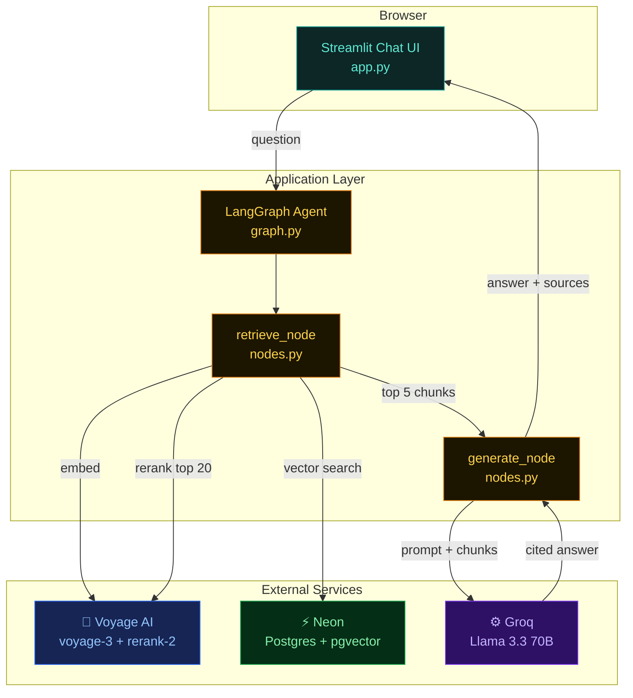
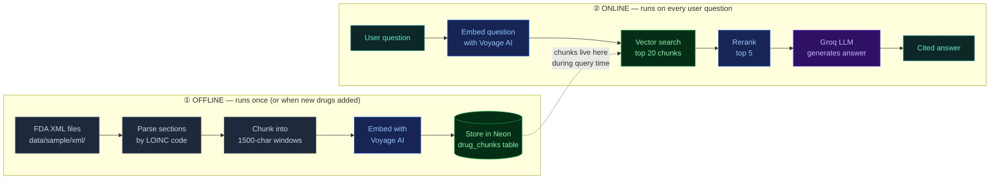

# 1. Architecture Overview

This page answers two questions:
1. **What is this project, in plain English?**
2. **How are all the pieces connected?**

---

## What is RAG?

**RAG = Retrieval-Augmented Generation.**

Instead of asking a generic LLM to answer drug questions from its training data (where it might hallucinate or be out of date), we do something smarter:

1. **Retrieve** — search a curated database of real FDA drug labels for passages relevant to the question
2. **Augment** — give those exact passages to the LLM along with the question
3. **Generate** — have the LLM write an answer *only* from what those passages say, and cite them

The LLM never "remembers" drug facts. It only summarises what we hand it. That's why answers are grounded, citable, and reliable.

---

## The full system at a glance

Five layers, five responsibilities:

| Layer | Component | Job |
|---|---|---|
| **UI** | Streamlit | Chat interface in the browser |
| **Agent** | LangGraph | Orchestrates the retrieve → generate flow |
| **Embeddings** | Voyage AI `voyage-3` | Turns text into 1024-dim vectors |
| **Search** | Neon + pgvector | Stores vectors, finds nearest matches |
| **Reranker** | Voyage AI `rerank-2` | Re-scores top 20 → top 5 by true relevance |
| **LLM** | Groq Llama 3.3 70B | Writes the cited answer from retrieved chunks |

---

## Two phases, two lifetimes

The project runs in two very different modes. Understanding this split is the single most important concept.

### ① Offline — the ingestion pipeline

Runs once when you set up the project (or any time you add new drugs). Detailed in [Ingestion pipeline](./03-ingestion.md).

- **Input:** raw FDA XML files from DailyMed
- **Output:** 735 vector-indexed passages sitting in Neon, ready to be searched
- **Frequency:** once per drug, ever

### ② Online — the query pipeline

Runs every time a user asks a question. Detailed in [Query flow](./02-query-flow.md).

- **Input:** a plain-English question
- **Output:** a cited answer rendered in the browser
- **Latency:** ~2–4 seconds end-to-end

---

## Why this architecture?

A few non-obvious decisions worth flagging:

| Decision | Why |
|---|---|
| **pgvector instead of Pinecone/Weaviate** | One database for everything — text, metadata, and vectors. No second system to maintain. |
| **Voyage AI instead of OpenAI embeddings** | Higher retrieval quality (top of MTEB leaderboard for retrieval) and a generous free tier. |
| **Reranker on top of vector search** | Vector similarity ≠ true relevance. The reranker re-scores the top 20 using cross-attention and gives a much better top 5. |
| **Groq instead of OpenAI for generation** | Sub-second LLM latency (10× faster than typical APIs) and a truly free tier — no card required. |
| **LangGraph instead of LangChain** | Cleaner typed state, explicit nodes/edges, easier to debug and extend. |
| **Streamlit instead of Next.js + FastAPI** | Single-language stack. The full chat UI is ~330 lines of Python. |

---

## Tech stack summary

| Layer | Tool | Role |
|-------|------|------|
| Data source | [DailyMed](https://dailymed.nlm.nih.gov) SPL XML | Official FDA drug labels |
| Database | [Neon](https://neon.tech) (Postgres 16 + pgvector) | Stores text + vector embeddings |
| Embeddings | [Voyage AI](https://voyageai.com) `voyage-3` | Text → 1024-dim vector |
| Reranker | Voyage AI `rerank-2` | Re-scores search results |
| Agent | [LangGraph](https://langchain-ai.github.io/langgraph/) | Orchestrates retrieve → generate |
| LLM | [Groq](https://groq.com) `llama-3.3-70b-versatile` | Generates cited answers |
| UI | [Streamlit](https://streamlit.io) | Chat interface in the browser |

---

**Next:** [→ Query flow (online path)](./02-query-flow.md)
