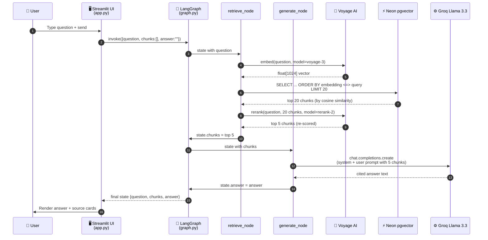
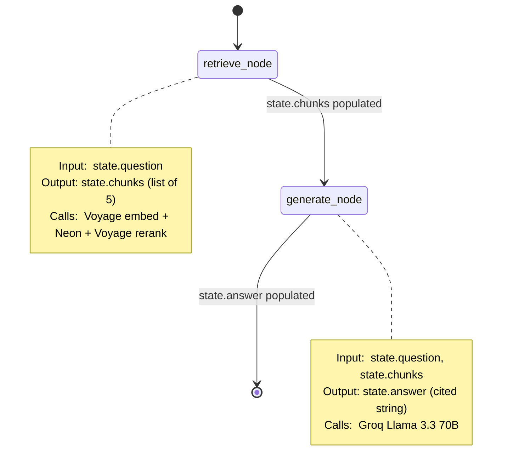
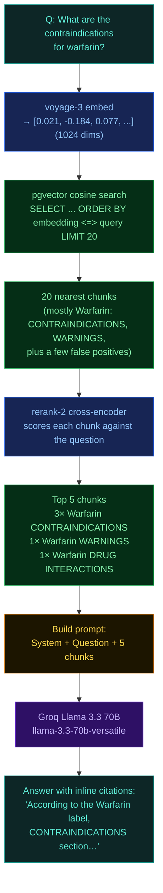
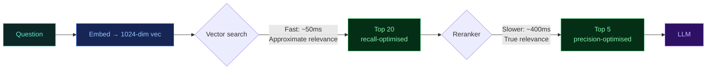

# 2. Query Flow — The Online Path

What happens between the moment a user clicks "Send" and the moment a cited answer appears in their browser. Read this if you want to understand the runtime behaviour of the app.

---

## The 60-second version


| Step | Service | What happens | Typical time |
|---|---|---|---|
| 1. Embed | Voyage AI `voyage-3` | Question text → 1024-dim float vector | ~200 ms |
| 2. Search | Neon + pgvector | Find top 20 nearest vectors using HNSW index | ~50 ms |
| 3. Rerank | Voyage AI `rerank-2` | Re-score top 20 with cross-attention → top 5 | ~400 ms |
| 4. Generate | Groq Llama 3.3 70B | Read 5 chunks + question, write cited answer | ~1–2 sec |
| **Total** | | | **~2–3 sec** |

---

## Full sequence diagram



---

## The LangGraph state graph

Internally, the agent is a tiny state machine with two nodes and one edge:



**Why a state graph instead of plain function calls?**

LangGraph gives us three things for free:

1. **Typed state** — every node knows exactly what fields exist (`question`, `chunks`, `answer`) and what types they are
2. **Auditable flow** — you can dump the graph as a diagram or trace every state transition
3. **Easy to extend** — want to add a "verify citations" node? Just add it as a new node between `generate_node` and the end

---

## What each node actually does

### `retrieve_node` — three calls, one job

Job: turn a question into the 5 most relevant chunks.

```python
def retrieve_node(state: AgentState) -> dict:
    # 1. Embed the question
    query_vec = voyage.embed([state["question"]], model="voyage-3", input_type="query").embeddings[0]

    # 2. Find 20 nearest chunks via pgvector cosine distance
    with psycopg.connect(DATABASE_URL) as conn:
        rows = conn.execute("""
            SELECT drug_name, section_name, chunk_text,
                   1 - (embedding <=> %s::vector) AS score
            FROM drug_chunks
            ORDER BY embedding <=> %s::vector
            LIMIT 20
        """, (query_vec, query_vec)).fetchall()

    # 3. Rerank those 20 with Voyage's cross-encoder, keep top 5
    reranked = voyage.rerank(state["question"], [r.chunk_text for r in rows],
                             model="rerank-2", top_k=5)
    top_chunks = [rows[r.index] for r in reranked.results]

    return {"chunks": top_chunks}
```

### `generate_node` — one call, with constraints

Job: turn 5 chunks + a question into a grounded, cited answer.

```python
SYSTEM_PROMPT = """
You are a medical information assistant. Answer ONLY from the provided
drug label excerpts. Cite the drug name and section for every claim.
If the excerpts don't contain the answer, say so explicitly.
"""

def generate_node(state: AgentState) -> dict:
    user_prompt = build_user_prompt(state["question"], state["chunks"])
    response = groq.chat.completions.create(
        model="llama-3.3-70b-versatile",
        messages=[
            {"role": "system", "content": SYSTEM_PROMPT},
            {"role": "user", "content": user_prompt},
        ],
    )
    return {"answer": response.choices[0].message.content}
```

The system prompt is the *entire* safety mechanism. The model literally cannot hallucinate drug facts because it only ever sees the 5 chunks we hand it.

---

## A real example — traced end to end

**Question:** *"What are the contraindications for warfarin?"*



---

## Why retrieve 20 then rerank to 5?

Vector similarity is **fast** but only approximately models relevance. It's great at "these texts feel similar" and bad at "which one actually answers this question?"



The two-stage approach gives us:
- **Recall** from the vector search (don't miss the right chunk)
- **Precision** from the reranker (don't waste LLM context on near-misses)

It's a classic information retrieval pattern and it works really well.

---

## Where this code lives

| File | What it contains |
|------|------------------|
| `src/fda_rag/ui/app.py` | Streamlit chat UI, sidebar, calls `agent.invoke()` |
| `src/fda_rag/agent/graph.py` | Builds the LangGraph `StateGraph` |
| `src/fda_rag/agent/nodes.py` | `retrieve_node` and `generate_node` implementations |
| `src/fda_rag/agent/state.py` | `AgentState` TypedDict |
| `src/fda_rag/retrieval/` | Vector search and rerank helpers |

---

**Next:** [→ Ingestion pipeline (offline path)](./03-ingestion.md)
