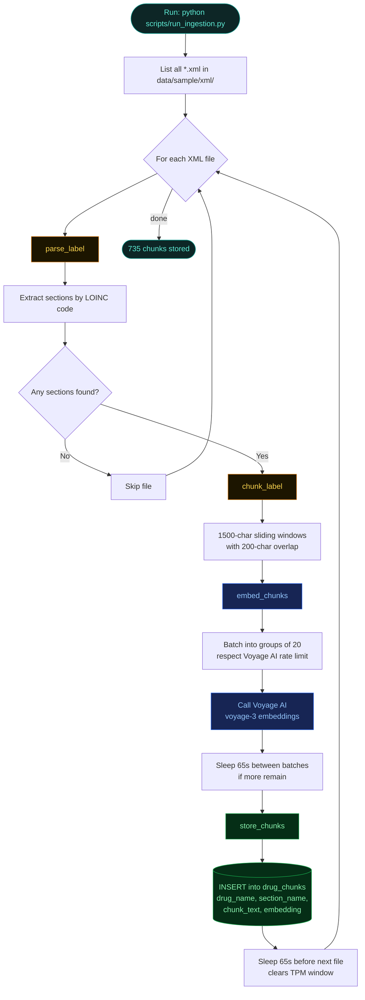
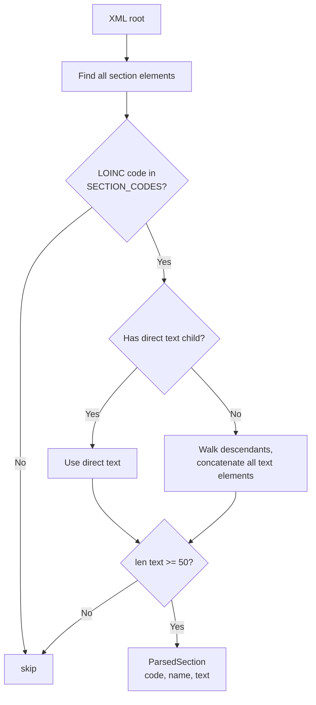
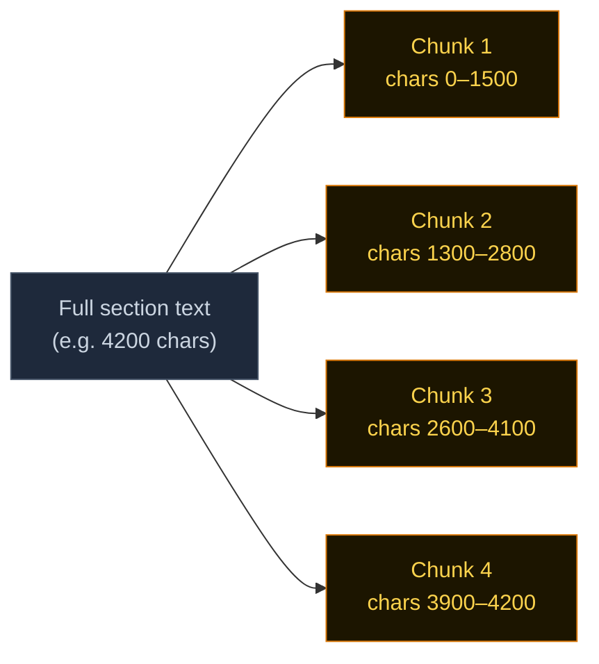
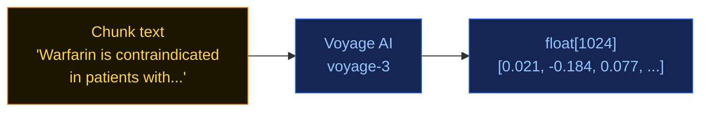
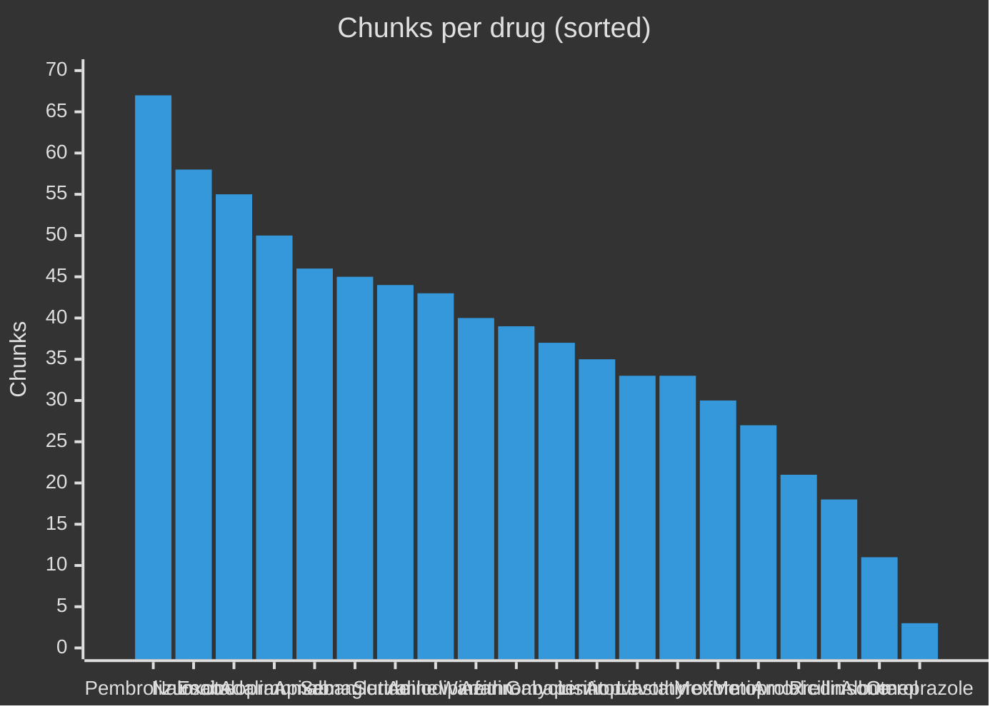

# 3. Ingestion Pipeline — The Offline Path

How raw FDA XML files become searchable vectors in Neon. This pipeline runs **once per drug, ever** (unless you re-ingest with a new parser).

---

## The 30-second version


| Step | What | Tool | Output |
|---|---|---|---|
| 1 | Download XML | `scripts/download_dailymed.py` (httpx) | `data/sample/xml/*.xml` |
| 2 | Parse sections | `src/fda_rag/ingestion/parser.py` (stdlib XML) | `ParsedLabel` objects |
| 3 | Chunk text | `src/fda_rag/ingestion/chunker.py` | `Chunk` objects (1500 chars) |
| 4 | Embed | `src/fda_rag/ingestion/loader.py` (Voyage AI) | `float[1024]` per chunk |
| 5 | Store | psycopg → Neon | Rows in `drug_chunks` |

---

## Full ingestion flow



---

## Step 1 — Download from DailyMed

DailyMed has a public API (no key required) that serves FDA drug labels in [SPL XML format](https://www.fda.gov/industry/fda-resources-data-standards/structured-product-labeling-resources).

```bash
# Download a specific drug
python scripts/download_dailymed.py --drug lisinopril

# Download the curated 10-drug starter set
python scripts/download_dailymed.py --sample
```

The script:
1. Searches DailyMed for the drug name → gets a `setId`
2. Downloads the SPL XML at `/services/v2/spls/{setId}.xml`
3. Saves to `data/sample/xml/{drug_name}.xml`

Rate limit: 1 request/second, enforced client-side. Polite by default.

---

## Step 2 — Parse XML into sections

Each SPL XML file has ~100+ `<section>` elements. We only care about the ones with meaningful clinical content, identified by their **LOINC code**.

### The 12 LOINC codes we extract

| LOINC | Section name |
|---|---|
| `34066-1` | BOXED WARNING |
| `34067-9` | INDICATIONS AND USAGE |
| `34068-7` | DOSAGE AND ADMINISTRATION |
| `34070-3` | CONTRAINDICATIONS |
| `34071-1` | WARNINGS |
| `43685-7` | WARNINGS AND PRECAUTIONS |
| `34084-4` | ADVERSE REACTIONS |
| `34073-7` | DRUG INTERACTIONS |
| `34090-1` | CLINICAL PHARMACOLOGY |
| `34088-5` | OVERDOSAGE |
| `34089-3` | DESCRIPTION |
| `43684-0` | USE IN SPECIFIC POPULATIONS |

### The parser handles two XML layouts

Some FDA labels nest text directly inside the section:
```xml
<section>
  <code code="34070-3"/>
  <text>Warfarin is contraindicated in patients with...</text>
</section>
```

Others nest it in subsections:
```xml
<section>
  <code code="34070-3"/>
  <!-- no <text> here -->
  <section>
    <code code="42229-5"/>
    <text>Warfarin is contraindicated in patients with...</text>
  </section>
</section>
```

The parser handles both by falling back to descendant `<text>` elements when the direct child is empty.



---

## Step 3 — Chunk into overlapping windows

LLMs and embedding models have token limits, and large embeddings dilute relevance. So we split each section into **1500-character windows with 200-character overlap**.



Why overlap? An important sentence might fall on a chunk boundary. With 200 chars of overlap, that sentence appears in both chunks → vector search will still find it whichever side the embedding lands on.

---

## Step 4 — Embed with Voyage AI

Each chunk is sent to Voyage AI's `voyage-3` model and returned as a 1024-dimension float vector.



**Rate-limit gotchas (Voyage free tier):**
- 3 requests per minute (RPM)
- 10,000 tokens per minute (TPM)

The script handles this by:
- Batching 20 chunks per API call
- Sleeping 65 seconds between batches and between files
- Using `input_type="document"` (the embedding model has different optimisations for documents vs queries)

---

## Step 5 — Store in Neon

The final step writes everything to the `drug_chunks` table in Neon Postgres. Schema details are in [Database & pgvector search](./04-database.md).

```sql
INSERT INTO drug_chunks (
    drug_name, set_id, section_code, section_name,
    chunk_index, chunk_text, embedding
) VALUES (...)
```

**One connection per file**: the script opens a fresh `psycopg.connect()` for every XML file. Neon serverless connections idle-time-out during the 65-second sleeps, so a shared connection across the whole loop would drop halfway through. This was a real bug we hit and fixed.

---

## Real numbers — what's in the database right now

After running ingestion on all 20 sample drugs:



**Total: 735 chunks across 20 drugs.**

Heavier drugs (Pembrolizumab, Adalimumab) have long boxed warnings and complex clinical pharmacology sections. Lighter drugs (Omeprazole, Albuterol) have shorter labels.

---

## Running it yourself

```bash
# 1. Set up the table (run once)
python scripts/migrate.py

# 2. Download drug labels
python scripts/download_dailymed.py --sample

# 3. Run the full pipeline
python scripts/run_ingestion.py
```

**How long does this take?** With Voyage AI's free tier rate limits, ingesting 20 drugs takes about **15 minutes** end-to-end (mostly waiting between batches). After it finishes you'll see something like:

```
Done. 735 chunks stored in Neon.
```

---

## Where this code lives

| File | What it contains |
|------|------------------|
| `scripts/download_dailymed.py` | DailyMed API client, downloads XML |
| `scripts/migrate.py` | Creates `drug_chunks` table + HNSW index |
| `scripts/run_ingestion.py` | Orchestrates the full pipeline |
| `src/fda_rag/ingestion/parser.py` | XML → `ParsedLabel` (sections + text) |
| `src/fda_rag/ingestion/chunker.py` | `ParsedLabel` → `Chunk` (1500-char windows) |
| `src/fda_rag/ingestion/loader.py` | `Chunk` → embedding → DB row |

---

**Next:** [→ Database & pgvector search](./04-database.md)
