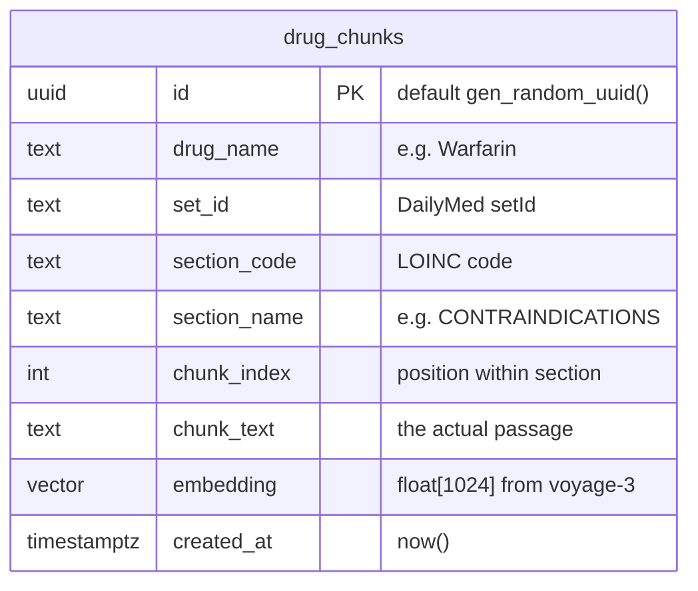
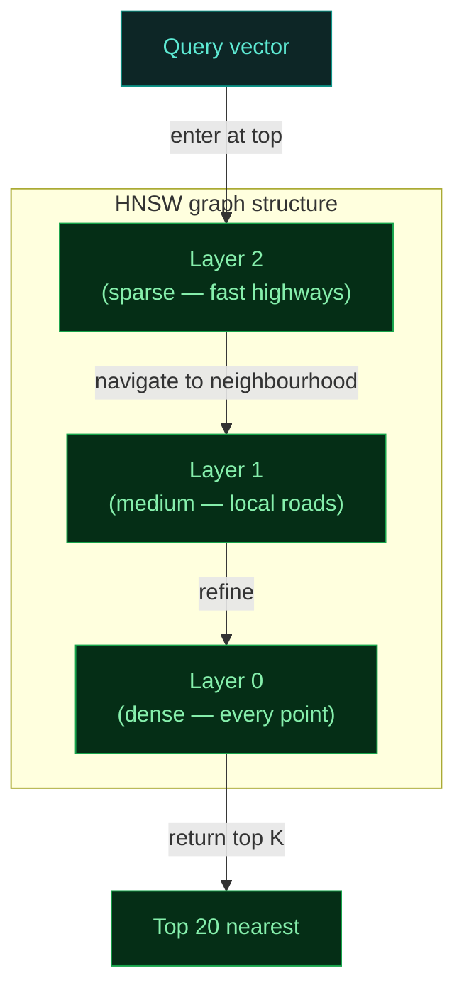
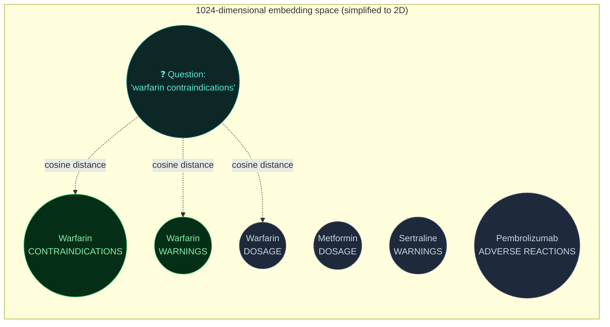
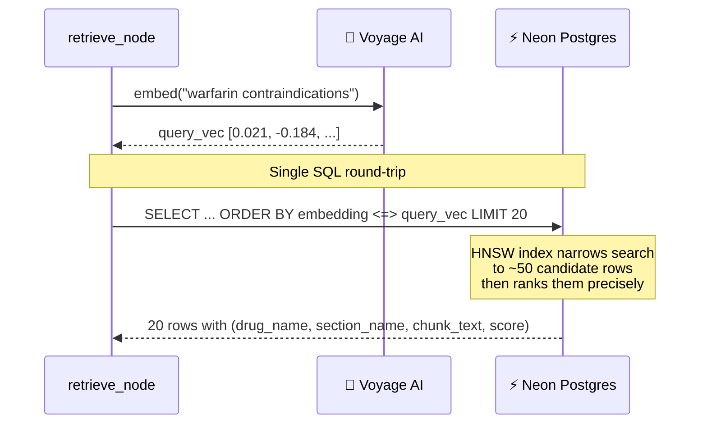

# 4. Database & pgvector Search

How 735 vectors live in Postgres, and how a question vector finds the right answers in 50 milliseconds.

---

## The table — `drug_chunks`

One row per chunk. One database for text + metadata + vectors.



### Why everything in one table?

A common alternative is a two-system setup: relational DB for text and metadata, vector DB (Pinecone/Weaviate/Qdrant) for embeddings. That requires:
- Two systems to deploy
- Two systems to keep in sync
- Joins across systems at query time

By keeping everything in one Postgres table with pgvector, the query is a single SQL statement that returns text *and* score in one shot. Simpler operationally, often faster too.

---

## The HNSW index

Without an index, vector similarity search is O(n) — you'd compute the cosine distance from your query to every single row, then sort. With 735 rows that's actually fine, but it doesn't scale to millions.

[HNSW](https://arxiv.org/abs/1603.09320) (Hierarchical Navigable Small World) is an approximate nearest-neighbour index that gets you log-ish lookup time at the cost of a small recall hit.

```sql
CREATE INDEX ON drug_chunks
USING hnsw (embedding vector_cosine_ops);
```



The index sits in memory and lets pgvector answer "find me the 20 closest vectors to this one" in milliseconds instead of seconds.

---

## How similarity search works (conceptually)

Each chunk lives as a point in 1024-dimensional space. Similar chunks cluster together — the embedding model has been trained so that texts about similar concepts produce vectors close to each other.



The chunks closest to the question vector are likely to be the most relevant ones. pgvector's `<=>` operator computes cosine distance and returns rows sorted by it.

---

## The actual query

This is what runs every time a user asks a question:

```sql
SELECT
    drug_name,
    section_name,
    chunk_text,
    1 - (embedding <=> $1::vector) AS score
FROM drug_chunks
ORDER BY embedding <=> $1::vector
LIMIT 20;
```

| Piece | What it does |
|---|---|
| `embedding <=> $1::vector` | Cosine distance between stored vector and query vector |
| `1 - (...)` | Flip distance to similarity (higher = more relevant) |
| `ORDER BY ... <=> ...` | Sort ascending by distance (closest first) — this is what triggers HNSW |
| `LIMIT 20` | Stop early once we have 20 |

The HNSW index makes the `ORDER BY ... <=> ...` clause fast. Without it, Postgres would do a full sequential scan + sort.

---

## Putting it on a map — schema → query → result



---

## Schema migration

The whole schema fits in a few lines of SQL — `scripts/migrate.py` runs this against your Neon instance:

```sql
CREATE EXTENSION IF NOT EXISTS vector;

CREATE TABLE IF NOT EXISTS drug_chunks (
    id            UUID PRIMARY KEY DEFAULT gen_random_uuid(),
    drug_name     TEXT NOT NULL,
    set_id        TEXT NOT NULL,
    section_code  TEXT NOT NULL,
    section_name  TEXT NOT NULL,
    chunk_index   INT  NOT NULL,
    chunk_text    TEXT NOT NULL,
    embedding     vector(1024) NOT NULL,
    created_at    TIMESTAMPTZ DEFAULT now()
);

CREATE INDEX IF NOT EXISTS drug_chunks_embedding_idx
ON drug_chunks
USING hnsw (embedding vector_cosine_ops);
```

That's the entire database. No joins, no foreign keys, no separate vector store. Postgres handles all of it.

---

## Why cosine distance specifically?

pgvector supports three distance metrics:

| Operator | Distance | When to use |
|---|---|---|
| `<->` | L2 (Euclidean) | When vector *magnitudes* matter |
| `<#>` | Negative inner product | Fast, similar to cosine when vectors are normalised |
| `<=>` | Cosine distance | When you only care about *direction* (the angle between vectors) |

For text embeddings, **cosine is the standard choice**. The magnitude of an embedding vector doesn't carry semantic meaning — only its direction does. Cosine ignores magnitude entirely.

---

## Where this code lives

| File | What it contains |
|------|------------------|
| `scripts/migrate.py` | Creates the table and HNSW index |
| `src/fda_rag/ingestion/loader.py` | `store_chunks` — INSERTs |
| `src/fda_rag/retrieval/search.py` | `vector_search` — the SELECT query |
| `src/fda_rag/agent/nodes.py` | `retrieve_node` calls `vector_search` |

---

**Next:** [→ Code walkthrough](./05-code-walkthrough.md)
