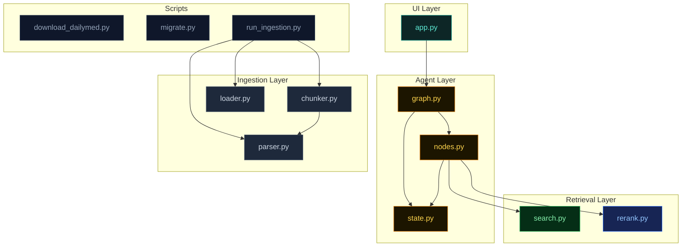

# 5. Code Walkthrough

A map of the codebase. Use this when you want to find where something lives or understand the dependency structure.

---

## Project structure

```
fda-rag/
├── src/fda_rag/
│   ├── ingestion/          # Offline pipeline — runs once per drug
│   │   ├── parser.py       #   XML → ParsedLabel (sections)
│   │   ├── chunker.py      #   ParsedLabel → list[Chunk] (1500-char windows)
│   │   └── loader.py       #   Chunk → embedding → Neon row
│   │
│   ├── retrieval/          # Vector search + reranker
│   │   ├── search.py       #   pgvector SELECT
│   │   └── rerank.py       #   Voyage rerank-2
│   │
│   ├── agent/              # LangGraph orchestration
│   │   ├── state.py        #   AgentState TypedDict
│   │   ├── nodes.py        #   retrieve_node + generate_node
│   │   └── graph.py        #   build_graph() — wires nodes together
│   │
│   ├── api/                # FastAPI HTTP wrapper (optional)
│   │   └── main.py         #   POST /query, GET /health
│   │
│   └── ui/                 # Streamlit chat UI
│       └── app.py          #   The whole frontend in one file
│
├── scripts/
│   ├── download_dailymed.py   # Fetch XML from DailyMed API
│   ├── migrate.py             # Create drug_chunks table + HNSW index
│   └── run_ingestion.py       # Run the full ingestion pipeline
│
├── data/sample/xml/        # 20 committed FDA XML files (~5 MB)
├── tests/                  # pytest tests for each layer
├── docs/                   # ← you are here
├── .env.example            # Template for DATABASE_URL, VOYAGE_API_KEY, GROQ_API_KEY
└── requirements.txt        # Python dependencies
```

---

## Dependency graph — who imports who



Notice: the **ingestion layer is fully decoupled from the agent layer**. They share no code. That's by design — you can re-implement either side independently.

---

## File-by-file

### `src/fda_rag/ui/app.py` — Streamlit chat UI

The entire frontend. About 350 lines of Python that handle:
- Chat input + history (uses `st.chat_input` and `st.chat_message`)
- Sidebar with example questions, drug compare, scope filter
- Source card rendering with section-aware styling (boxed warnings get red, dosage gets blue, etc.)
- Custom CSS for the dark theme (no Streamlit defaults visible)

**Key entry point:**
```python
prompt = st.chat_input(...)
if prompt:
    answer, sources = run_query(prompt)
    st.markdown(answer)
    render_sources(sources)
```

`run_query` calls `agent.invoke(...)` and unpacks the final state.

---

### `src/fda_rag/agent/state.py` — typed state

```python
from typing import TypedDict
from fda_rag.retrieval.search import RetrievedChunk

class AgentState(TypedDict):
    question: str
    chunks: list[RetrievedChunk]
    answer: str
```

Three fields. Every node reads from and writes to this state.

---

### `src/fda_rag/agent/nodes.py` — the two nodes

#### `retrieve_node`
1. Embeds the question with Voyage AI
2. Runs `vector_search` against Neon
3. Reranks the top 20 → top 5
4. Returns `{"chunks": top_5}`

#### `generate_node`
1. Builds a system + user prompt from question + chunks
2. Calls Groq's Llama 3.3 70B
3. Returns `{"answer": response.text}`

Falls back to a structured chunk dump if `GROQ_API_KEY` isn't set — useful for local testing without an LLM key.

---

### `src/fda_rag/agent/graph.py` — wiring

```python
from langgraph.graph import StateGraph, START, END
from fda_rag.agent.state import AgentState
from fda_rag.agent.nodes import retrieve_node, generate_node

def build_graph():
    g = StateGraph(AgentState)
    g.add_node("retrieve", retrieve_node)
    g.add_node("generate", generate_node)
    g.add_edge(START, "retrieve")
    g.add_edge("retrieve", "generate")
    g.add_edge("generate", END)
    return g.compile()
```

That's the entire orchestration. Two nodes, three edges.

---

### `src/fda_rag/retrieval/search.py` — pgvector query

```python
def vector_search(query_vec: list[float], top_k: int = 20) -> list[RetrievedChunk]:
    with psycopg.connect(DATABASE_URL) as conn:
        rows = conn.execute("""
            SELECT drug_name, section_name, chunk_text,
                   1 - (embedding <=> %s::vector) AS score
            FROM drug_chunks
            ORDER BY embedding <=> %s::vector
            LIMIT %s
        """, (query_vec, query_vec, top_k)).fetchall()
    return [RetrievedChunk(*row) for row in rows]
```

---

### `src/fda_rag/retrieval/rerank.py` — Voyage reranker

```python
def rerank(query: str, chunks: list[RetrievedChunk], top_k: int = 5):
    response = voyage.rerank(
        query,
        [c.chunk_text for c in chunks],
        model="rerank-2",
        top_k=top_k,
    )
    return [chunks[r.index] for r in response.results]
```

---

### `src/fda_rag/ingestion/parser.py` — XML → sections

Loops over every `<section>` in the SPL XML, filters by LOINC code (12 codes we care about), extracts text. Handles both flat and nested XML layouts.

```python
@dataclass
class ParsedSection:
    code: str    # LOINC, e.g. "34070-3"
    name: str    # "CONTRAINDICATIONS"
    text: str    # full section text

@dataclass
class ParsedLabel:
    drug_name: str
    set_id: str
    sections: list[ParsedSection]

def parse_label(path: Path) -> ParsedLabel: ...
```

---

### `src/fda_rag/ingestion/chunker.py` — section → chunks

Splits each section's text into 1500-char windows with 200-char overlap.

```python
@dataclass
class Chunk:
    drug_name: str
    set_id: str
    section_code: str
    section_name: str
    chunk_index: int
    chunk_text: str

def chunk_label(label: ParsedLabel) -> list[Chunk]: ...
```

---

### `src/fda_rag/ingestion/loader.py` — embed + store

Two public functions:
- `embed_chunks(chunks)` → list of 1024-dim vectors (batched + rate-limited)
- `store_chunks(conn, chunks, embeddings)` → INSERT them all

---

## Where to start reading

Depending on what you want to understand:

| Goal | Start here | Then |
|---|---|---|
| **How a query works** | `agent/graph.py` | `agent/nodes.py` → `retrieval/search.py` |
| **How data gets in** | `scripts/run_ingestion.py` | `ingestion/parser.py` → `chunker.py` → `loader.py` |
| **What the UI does** | `ui/app.py` | Trace the `run_query` function |
| **The database schema** | `scripts/migrate.py` | [Database doc](./04-database.md) |

---

## Tests

Each layer has its own `tests/` file:

```
tests/
├── test_parser.py      # XML parsing handles flat + nested layouts
├── test_chunker.py     # Windowing logic respects overlap
├── test_search.py      # pgvector returns expected ordering
├── test_nodes.py       # retrieve/generate produce valid states
└── test_graph.py       # Full agent.invoke() integration test
```

Run all tests:
```bash
pytest
```

---

## Configuration

All three external services use environment variables:

| Variable | Where to get it |
|---|---|
| `DATABASE_URL` | Neon project dashboard → Connection details |
| `VOYAGE_API_KEY` | https://dash.voyageai.com → API keys |
| `GROQ_API_KEY` | https://console.groq.com → API keys |

For local dev, put them in a `.env` file (copy `.env.example`). For Streamlit Cloud, put them in **Manage app → Secrets**.

---

That's the whole codebase. ~1000 lines of Python, no magic, all of it readable in an afternoon.

---

**Back to:** [📚 Documentation index](./README.md)
