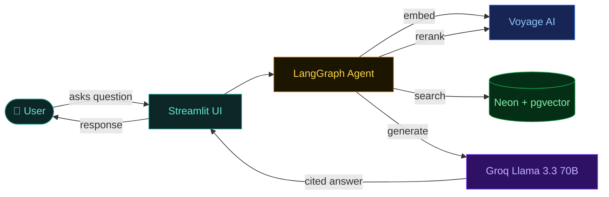

# FDA Drug Label Assistant — Documentation

Visual, end-to-end documentation for the FDA RAG project. Every page renders natively on GitHub — the Mermaid diagrams below show up directly in the browser, no extra tools required.

> **Tip:** If you're new here, read the pages in order. Each builds on the one before it.

---

## Contents

| # | Page | What's inside |
|---|---|---|
| 1 | [Architecture overview](./01-architecture.md) | The big picture — what RAG is, how the 5 services connect, the two phases (offline & online) |
| 2 | [Query flow (online path)](./02-query-flow.md) | Step-by-step trace of what happens when a user asks a question — sequence diagram + LangGraph state graph |
| 3 | [Ingestion pipeline (offline path)](./03-ingestion.md) | How FDA XML files become searchable vectors — parsing, chunking, embedding, storing |
| 4 | [Database & pgvector search](./04-database.md) | Schema, HNSW index, how cosine similarity finds the right passages |
| 5 | [Code walkthrough](./05-code-walkthrough.md) | File-by-file map of the codebase — which module does what, dependency graph |

---

## At a glance

---

## Project links

- **Live demo:** https://fda-rag-gmlp6hufrw3trprm8h2srz.streamlit.app
- **GitHub repo:** https://github.com/mateoportillo1900/fda-rag
- **Data source:** [DailyMed](https://dailymed.nlm.nih.gov) — official FDA drug label database

---

## Disclaimer

This documentation is for educational purposes. The FDA Drug Label Assistant is a portfolio project, not a substitute for professional medical advice.
